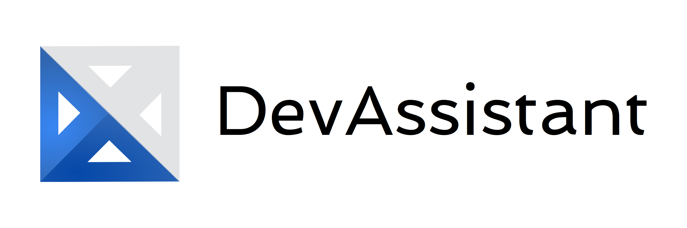
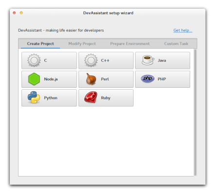
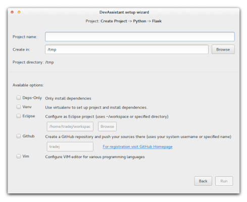

OpenAlt 2014

Tomáš Raděj,  [@tomasradej](http://twitter.com/tomasradej)


## O mně

Tomáš Raděj, Brno

**3 roky** *Fedora + Red Hat*

**2 roky** *Python*

**1 rok** *DevAssistant*


## O DevAssistantu

~ 2 roky ve vývoji

Napsán v Pythonu

Příkazová řádka + GUI

<!-- .element: class="fragment" -->
**<span style="color:navy">Fedora</span>** (primárně)


## Problém

Začít psát software ≠ otevřít editor

<!-- .element: class="fragment" -->
Závislosti

<!-- .element: class="fragment" -->
Nastavení editoru

<!-- .element: class="fragment" -->
Adresářová struktura

<!-- .element: class="fragment" -->
Soubory


## Správa kódu

Publikování

Distribuce (RPM, kontejnery)

Závislosti


## Cíl DevAssistantu

Nastavení prostředí

Automatizace

Jednotné nastavení

Sdílení prostředí v týmu (Docker)

"Magie" 1 kliknutím


## Cílová skupina

Začínající vývojáři 

Vývojáři z různých platforem - **<span style="color:navy">Linux</span>, <span style="color:purple">OSX</span>**

Týmy - unifikované prostředí


## Architektura

**Jádro** - GUI, příkazová řádka

<!-- .element: class="fragment" -->
*vyvíjíme my*

<!-- .element: class="fragment" -->
**Skripty** - Assistanty, Snippety

<!-- .element: class="fragment" -->
*vyvíjí komunita*

<!-- .element: class="fragment" -->
**Index** - Server se skripty


## Jádro

**<span style="color: #008A7A">Python</span>** 2 + 3

Nezávislé na skriptech

1 skript funguje v GUI i v příkazové řádce


## GUI




## GUI II.




## Příkazová řádka

```
    da create python flask --name MyFlaskApp --venv --github
```


## Skripty (Assistanty)

**YAML** - značkovací jazyk

**PingPong** - komunikace s ostatními jazyky

<!-- .element: class="fragment" -->
(nyní pouze **<span style="color: #008A7A">Python</span>**)


## Index

DevAssistant Package Index **(DAPI)**

Členové komunity nahrávají balíky se skripty

Odsud stahujete nové balíky


## Integrace (GitHub)

Vytváření repozitářů

Fork

Push


## Integrace (<span style="color: navy">Fedora</span>)

Bash completion

Infrastruktura, COPR (v budoucnu)


## Docker

Vytvoření vývojového prostředí v kontejneru

Sdílení prostředí v týmu (každý dostane stejný Assistant)

Build image pro deployment


## Ukázka I. (Nový projekt)

**Flask** - Webový framework v **<span style="color: #008A7A">Python</span>**u

Obsahuje webserver

Vyžaduje závislosti, pevnou adresářovou strukturu


## Ukázka II. (Existující kód)

Vytvoření repozitáře na **GitHub**u

Push existujícího kódu


## Ukázka III. (Fork na GitHubu)

Fork existujícího repozitáře na GitHubu

Stažení kódu a příprava prostředí


## Děkuji za pozornost

&nbsp;

#### Pro uživatele

 <https://www.devassistant.org>

**Index** <https://dapi.devassistant.org>

&nbsp;

#### Pro vývojáře

 <http://docs.devassistant.org>

 <https://www.github.com/devassistant>
